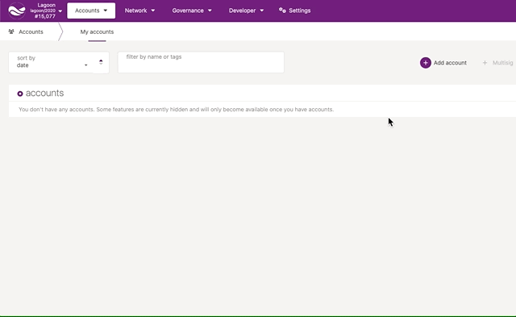
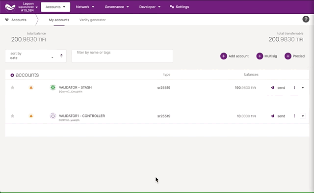
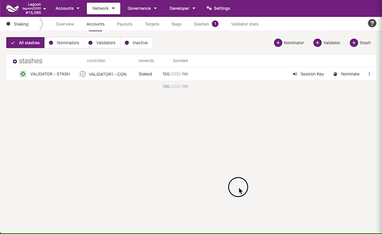
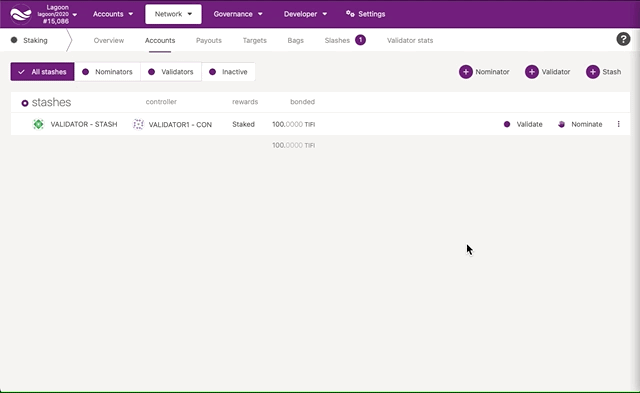

This page will instruct you how to set up a validator node on the TideChain Public Sandbox.

## Requirements

The most common way for a beginner to run a validator is on a cloud server running Linux. You may choose whatever VPS provider you prefer, and whichever operating system you are comfortable with. For this guide we will be using **Ubuntu 20.04**, but the instructions should be similar for other platforms.

The transaction weights in TideChain were benchmarked on standard hardware. It is recommended that validators run at least the standard hardware in order to ensure they are able to process all blocks in time. The following are not minimum requirements but if you decide to run with less than this, you may experience performance issues.

### Standard Hardware

For the full details of the standard hardware please see [here](https://github.com/paritytech/substrate/pull/5848)

- **CPU** - Intel(R) Core(TM) i7-7700K CPU @ 4.20GHz
- **Storage** - A NVMe solid state drive. Should be reasonably sized to deal with blockchain growth. Starting around 80GB - 160GB will be okay for the first six months of TiDeFi, but will need to be re-evaluated every six months.
- **Memory** - 64GB

The specs posted above are by no means the minimum specs that you could use when running a validator, however you should be aware that if you are using less you may need to toggle some extra optimizations in order to match up to other validators that are running the standard.

## Building and Installing the `Tidechain` binary

### Using a prebuilt

The nature of pre-built binaries means that they may not work on your particular architecture or Linux distribution. If you see an error like `cannot execute binary file: Exec format error` it likely means the binary is not compatible with your system. You will either need to compile the source code or use Docker.

Download the latest Tidechain binary within Ubuntu by running the following command.

```
curl -sL https://github.com/tidelabs/tidechain/releases/latest/download/tidechain && chmod +x tidechain && mv tidechain /usr/local/bin/
```

### Build from source

To build the `Tidechain` binary from the source-code, use the [release](https://github.com/tidelabs/tidechain/tree/release) branch and follow the instructions in the [README](../README.md#build-from-source).

## Synchronize Chain Data

You can synchronize your node by running the following commands if you do not want to start in validator mode right away:

```
tidechain --chain=lagoon --pruning=archive
```

The `--pruning=archive` flag is implied by the `--validator` flag, it is only required explicitly if you start your node without one of these two options. If you do not set your pruning to archive node, even when not running in validator mode, you will need to re-sync your database when you switch.

## Bond TIFI

Bonding funds is the first step to validate. It locks up a portion of funds that is used to secure the network. These funds are placed at risk, i.e. you can be slashed and lose a portion if the validator node misbehaves. Validators and nominators share both rewards and the slashing effects.

For bonding (with an intention to validate), you need to have 2 accounts -

- _Stash_ This is the primary account that holds the funds and has a portion bonded for participation;
- _Controller_ This is used to control the operation of the validator, switching between validating and idle; (It only needs enough funds to send transactions when actions are taken)

First you need to download the latest [Tidechain explorer here](https://github.com/tidelabs/explorer/releases/latest).



You will need to create two accounts and make sure each of them have enough funds to pay the fees for sending transactions.

Make sure not to bond all your TIFI balance since you will be unable to pay transaction fees from your bonded balance.

It is now time to set up your validator. You will want to go to the Network > Staking section.
Click on "Accounts", and then the "+ Stash" button.



Click on "Bond" once you have selected the stash and controller accounts. Make sure to validate the value bonded.

### Generating the Session Keys

You need to tell the chain your Session keys by signing and submitting an extrinsic. This is what associates your validator node with your Controller account on Tidechain.

You will now start the chain with RPC unsafe mode, make sure to stop it once this step is complete.

```
tidechain --chain=lagoon --validator --rpc-methods=unsafe
```

Once your node is started open another terminal and run this command:

```
curl -H "Content-Type: application/json" -d '{"id":1, "jsonrpc":"2.0", "method": "author_rotateKeys", "params":[]}' http://localhost:9933
```

The output will have a hex-encoded "result" field. The result is the concatenation of the four public keys. Save this result for the next step.

You can restart your node at this point without the `--rpc-methods=unsafe` flags.

### Submitting the `setKeys` Transaction

You need to tell the chain your Session keys by signing and submitting an extrinsic. This is what associates your validator with your Controller account.



Submit this extrinsic and you are now ready to start validating.

### Submit intention to validate

You need to submit your intention to validate when you are ready.



The validator set is refreshed every era. In the next era (every 24 hours), if there is a slot available and your node is selected to join the validator set, your node will become an active validator. Until then, it will remain in the waiting queue. If your validator is not selected to become part of the validator set, it will remain in the waiting queue until it is. There is no need to re-start if you are not selected for the validator set in a particular era. However, it may be necessary to increase the number of TIFI bonded or seek out nominators for your validator in order to join the validator set.
